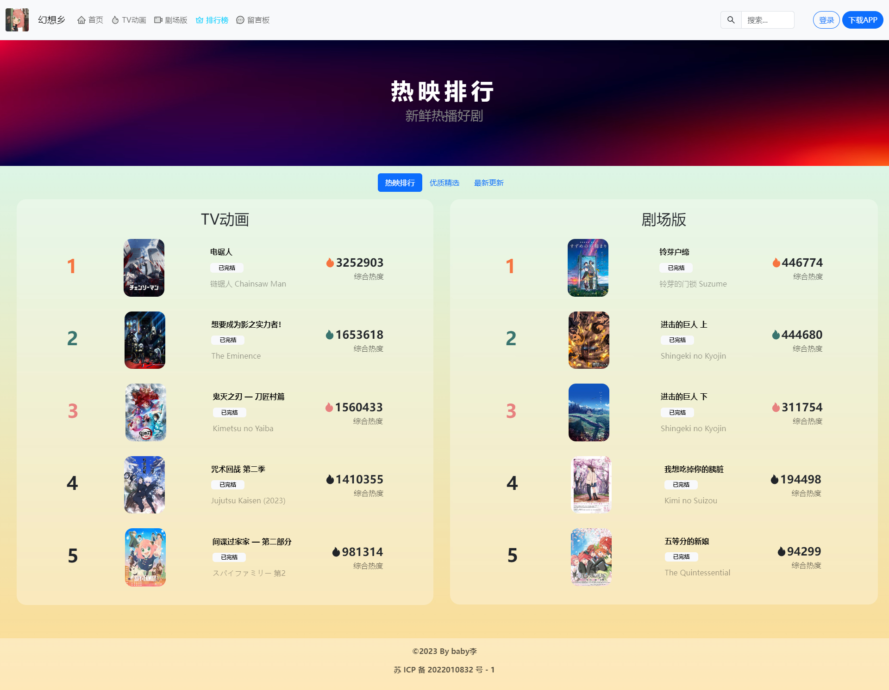

# NIT《前端高级开发技术》期末作业个人作品🌱

> 仿番剧网站的一个样例 ( 糊弄作业，尚未完工 WIP🚧 )
>
> 引用资源如有侵权，联系删除 | 联系QQ：2105451348

国内镜像: [Gitee](https://gitee.com/babyly/ntit-html-final)

## 项目简述

使用 `Bootstrap 5` 作为主体框架开发的响应式页面，契合《前端高级开发技术》课程内容。
适合学习 HTML / CSS / Bootstrap 等内容的同学作为开发参考。
(当然，如果时间宝贵或者一学期没咋听的话，直接Copy并修改一部分内容就可以糊弄作业了 :D)

## 效果预览

[Github Page](https://fn.withzhou.xyz/) (国内部分网络可能无法访问)

<div align="center">
  
  
  
  
</div>

## 前置环境

- Node.JS v20.10.0
- Pnpm 8.15.3 (使用 Npm / Yarn 同理)

## 技术选型

| Package                  | Version | Comment         |
| ------------------------ | ------- | --------------- |
| Vite                     | 4.5.0   | 构建工具        |
| Typescript               | 5.2.2   | 类型检查        |
| UnoCSS                   | 0.57.4  | 原子化CSS引擎   |
| Sass                     | 1.69.5  | CSS预处理器     |
| bootstrap                | 5.3.2   | UI框架          |
| swiper                   | 11.0.4  | 轮播            |
| sweetalert2              | 11.10.1 | 提示组件        |
| axios                    | 1.6.2   | 网络请求库      |
| artplayer                | 5.0.9   | 播放器          |
| artplayer-plugin-danmuku | 5.0.1   | 播放器插件-弹幕 |

## 使用说明

1. 克隆本项目

    ```bash
    git clone https://github.com/BabyLy233/ntit-html-final.git
    ```

2. 进入项目目录并安装依赖

    ```bash
    cd ntit-html-final
    pnpm install
    ```

3. 以 `dev` 模式启动 Vite

    ```bash
    pnpm dev
    ```

4. 修改代码，进行开发

5. 打包项目，部署页面 (可选)

    ```bash
    pnpm build
    ```
